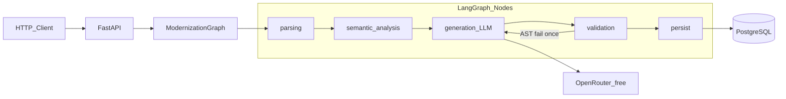

# Modernization Pipeline — PL/pgSQL → Python 3.14

Pipeline híbrido (**regras determinísticas + LLM**) que moderniza stored procedures/functions PostgreSQL (PL/pgSQL) para módulos Python 3.14. Orquestração com **LangGraph**, geração via **OpenRouter** (modelos `:free`), persistência em **PostgreSQL**, observabilidade opcional com **Langfuse** self-hosted.

Repositório: [github.com/m4rkdevbr/F4bioMiranteTeste2026](https://github.com/m4rkdevbr/F4bioMiranteTeste2026)

## Arquitetura do grafo LangGraph



| Nó | Determinístico? | Função |
|----|-----------------|--------|
| `parsing` | Sim | Extrai IR (sqlglot + parser PL/pgSQL) |
| `semantic_analysis` | Sim | Parâmetros, cursores, riscos, hints de tradução |
| `generation` | LLM | OpenRouter free chain + prompt estruturado a partir do IR |
| `validation` | Sim | `ast.parse`, ruff, métricas; retry único se AST falhar |
| `persist` | Sim | Sempre grava `modernization_history` |

## Decisões técnicas (trade-offs)

1. **SQL híbrido no Python**: agregações/set-based e CTEs complexas permanecem como SQL parametrizado (SQLAlchemy); controle de fluxo e validações migram para Python.
2. **Transações (`FOR UPDATE`)**: uma transação explícita no Python — não reescrever locks em optimistic locking ad hoc.
3. **Cursores (Anexo E)**: hint explícito anti-N+1 (set-based / bulk). Tradução ingênua linha a linha é marcada como risco crítico.
4. **LLM free (OpenRouter)**: primary `qwen/qwen3.8-27b:free` com fallback Nemotron → Gemma → Cohere code → `openrouter/free`. Rate-limit é tratado pela cadeia.
5. **Prompt nunca é a procedure crua sozinha**: user message = JSON(IR + semantic_profile + schema opcional).

## Pré-requisitos

- Docker + Docker Compose
- Python 3.12+ (imagem do serviço usa 3.12; código alinhado a Python 3.14 / 3.12+)
- Chave OpenRouter (modelos free)

## Setup rápido

```bash
cp .env.example .env
# edite .env e preencha OPENROUTER_API_KEY

docker compose up --build -d postgres
pip install -e ".[dev]"
# aguarde health do Postgres, depois:
docker compose up --build -d pipeline
```

Variáveis principais (ver `.env.example`):

| Variável | Descrição |
|----------|-----------|
| `OPENROUTER_API_KEY` | Chave OpenRouter (somente `.env` local) |
| `LLM_MODEL` | Modelo free primary |
| `LLM_FALLBACK_MODELS` | Cadeia de fallback free |
| `DATABASE_URL` | SQLAlchemy async (`postgresql+asyncpg://...`) |
| `LANGFUSE_*` | Opcional; `LANGFUSE_ENABLED=false` por padrão |

## API

### `GET /health`

```bash
curl -s http://localhost:8123/health
```

Exemplo: `{"status":"ok","postgres":"ok","langfuse":"disabled"}`

### `POST /modernize`

```bash
curl -s -X POST http://localhost:8123/modernize \
  -H "Content-Type: application/json" \
  -d "{\"source_code\": \"$(cat sql/fixtures/anexo_b_fn_saldo_cliente.sql | jq -Rs .)\"}"
```

Resposta:

```json
{
  "status": "success|partial|failure",
  "generated_code": "...",
  "report": { "parsing": {}, "semantic_analysis": {}, "generation": {}, "validation": {}, "evaluation": {}, "timings_ms": {} },
  "history_id": "uuid",
  "run_id": "uuid"
}
```

### `GET /evaluation/summary`

Agrega métricas registradas em `pipeline_evaluation_scores`.

## Banco de dados

Tabela obrigatória `modernization_history` (criada em `sql/init/01_schema.sql`):

- `id`, `source_code`, `generated_code`, `report` (JSONB), `status`, `created_at`

Toda execução é persistida, independentemente do desfecho.

## Casos de teste (Anexos B–F)

Fixtures em `sql/fixtures/`. Schema de contexto: `anexo_a_schema.sql`.

```bash
# com Postgres + OPENROUTER_API_KEY configurados
set PYTHONPATH=src
python scripts/run_annexes.py
```

Saídas em `fixtures/output/*.py` e `*.report.json`.

| Anexo | Procedure | Complexidade | Resultado local | Modelo |
|-------|-----------|--------------|-----------------|--------|
| B | `fn_saldo_cliente` | Baixa | success (AST ok) | `qwen/qwen3.8-27b:free` |
| C | `sp_atualizar_status_contas_inativas` | Baixa-média | partial (AST ok) | `nvidia/nemotron-3-super-120b-a12b:free` |
| D | `sp_transferir_entre_contas` | Média | partial (AST ok) | `nvidia/nemotron-3-super-120b-a12b:free` |
| E | `sp_processar_lote_taxas` | Alta | partial (AST ok) | `nvidia/nemotron-3-super-120b-a12b:free` |
| F | `sp_relatorio_mensal_cliente` | Muito alta | partial (AST ok) | `nvidia/nemotron-3-super-120b-a12b:free` |

`partial` indica AST válido com findings de ruff (estilo), não falha de tradução. Artefatos em `fixtures/output/`.


## Qualidade

```bash
ruff check src tests scripts
mypy src/modernization_pipeline
pytest -q
```

CI GitHub Actions executa os mesmos checks (LLM mockado nos testes de API).

## Observabilidade (bônus)

Integração Langfuse via callbacks LangChain quando `LANGFUSE_ENABLED=true`. Ver [docs/OBSERVABILITY.md](docs/OBSERVABILITY.md). Capture de traces pode ser anexada em `docs/assets/langfuse-traces.png`.

## Escalabilidade (próximos passos)

- Fila Redis + workers para `/modernize` assíncrono
- Cache de parsing por hash de `source_code`
- Interface `SqlDialect` para T-SQL / PL/SQL
- Troca de modelo só por env (`LLM_MODEL`)

## Limitações conhecidas

- Cobertura sintática PL/pgSQL não é total (foco em desenho da pipeline e anexos B–F).
- Modelos free podem oscilar em qualidade/latência; mitigado por IR + validação + fallback.
- Equivalência comportamental contra banco de teste não é assertiva na v1 (métricas estruturais + AST).
- Stack Langfuse completa (ClickHouse etc.) fica documentada para compose avançado; default roda sem custo SaaS.

## Documentação adicional

- [docs/ARCHITECTURE.md](docs/ARCHITECTURE.md)
- [docs/DEVELOPMENT.md](docs/DEVELOPMENT.md)
- [docs/API.md](docs/API.md)
- [docs/LLM_AND_PROMPTS.md](docs/LLM_AND_PROMPTS.md)
- [docs/EVALUATION.md](docs/EVALUATION.md)
- [docs/OBSERVABILITY.md](docs/OBSERVABILITY.md)
- [docs/INTERVIEW_NOTES.md](docs/INTERVIEW_NOTES.md)

## Bibliotecas externas (justificativa)

| Biblioteca | Motivo |
|------------|--------|
| langgraph | Orquestração em grafo exigida |
| langchain-openai | Cliente OpenAI-compatible → OpenRouter |
| sqlglot | Parsing SQL Postgres robusto |
| sqlalchemy/asyncpg | Persistência asyncpg; SQLAlchemy como padrão no código gerado |
| fastapi/uvicorn | Endpoints `/modernize` e `/health` |
| langfuse | Observabilidade (bônus) |
| ruff/mypy/pytest | Qualidade estática e testes (bônus) |

## Licença

MIT
