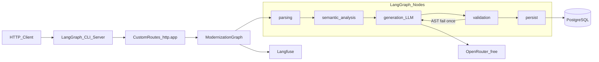
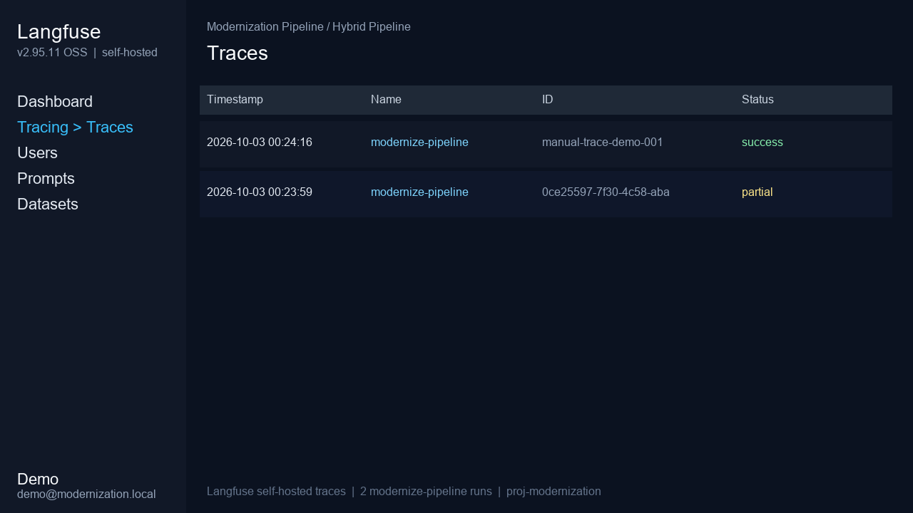

# Modernization Pipeline — PL/pgSQL → Python 3.14

Pipeline híbrido (**regras determinísticas + LLM**) que moderniza stored procedures/functions PostgreSQL (PL/pgSQL) para módulos Python 3.14. Orquestração com **LangGraph CLI**, geração via **OpenRouter** (modelos `:free`), persistência em **PostgreSQL**, observabilidade com **Langfuse** self-hosted (opcional).

Repositório: [github.com/m4rkdevbr/F4bioMiranteTeste2026](https://github.com/m4rkdevbr/F4bioMiranteTeste2026)

## Arquitetura do grafo LangGraph



| Nó | Determinístico? | Função |
|----|-----------------|--------|
| `parsing` | Sim | Extrai IR (sqlglot + parser PL/pgSQL) |
| `semantic_analysis` | Sim | Parâmetros, cursores, riscos, hints de tradução |
| `generation` | LLM | OpenRouter free chain + prompt estruturado a partir do IR |
| `validation` | Sim | `ast.parse`, ruff, métricas; retry único se AST falhar |
| `persist` | Sim | Sempre grava `modernization_history` |

Configuração oficial do servidor: [`langgraph.json`](langgraph.json) com `graphs.modernize` e `http.app` apontando para as rotas custom `POST /modernize` e `GET /health`.

## Decisões técnicas (trade-offs)

1. **SQL híbrido no Python**: agregações/set-based e CTEs complexas permanecem como SQL parametrizado (SQLAlchemy); controle de fluxo e validações migram para Python.
2. **Transações (`FOR UPDATE`)**: uma transação explícita no Python — não reescrever locks em optimistic locking ad hoc.
3. **Cursores (Anexo E)**: hint explícito anti-N+1 (set-based / bulk). Tradução ingênua linha a linha é marcada como risco crítico.
4. **LLM free (OpenRouter)**: primary `qwen/qwen3.8-27b:free` com fallback Nemotron → Gemma → Cohere code → `openrouter/free`.
5. **Prompt nunca é a procedure crua sozinha**: user message = JSON(IR + semantic_profile + schema opcional).
6. **Runtime do servidor**: Python 3.12 na imagem Docker; **artefato gerado** mira Python 3.14 (type hints / estilo moderno).

## Pré-requisitos

- Docker + Docker Compose
- Chave OpenRouter (modelos free)

## Setup rápido (somente Compose)

```bash
cp .env.example .env
# preencha OPENROUTER_API_KEY no .env

docker compose up --build -d
```

Serviços:

| Serviço | URL |
|---------|-----|
| LangGraph CLI + custom routes | http://localhost:8123 |
| OpenAPI / Swagger | http://localhost:8123/docs |
| PostgreSQL | localhost:5432 |

Health check:

```bash
curl -s http://localhost:8123/health
```

Desenvolvimento local com LangGraph CLI (sem rebuild da imagem):

```bash
pip install -e ".[dev]"
docker compose up -d postgres
langgraph dev --host 127.0.0.1 --port 8123
```

### Variáveis de ambiente (`.env.example`)

| Variável | Descrição |
|----------|-----------|
| `OPENROUTER_API_KEY` | Chave OpenRouter (somente `.env` local) |
| `LLM_MODEL` | Modelo free primary |
| `LLM_FALLBACK_MODELS` | Cadeia de fallback free |
| `DATABASE_URL` | asyncpg DSN (`postgresql+asyncpg://...`) |
| `DATABASE_URL_SYNC` | DSN sync/`postgresql://...` |
| `LANGFUSE_ENABLED` | `true`/`false` |
| `LANGFUSE_HOST` / `LANGFUSE_PUBLIC_KEY` / `LANGFUSE_SECRET_KEY` | Observabilidade |

## API (rotas custom do LangGraph CLI)

### `GET /health`

```bash
curl -s http://localhost:8123/health
```

### `POST /modernize`

```bash
curl -s -X POST http://localhost:8123/modernize \
  -H "Content-Type: application/json" \
  -d "{\"source_code\": $(jq -Rs . sql/fixtures/anexo_b_fn_saldo_cliente.sql)}"
```

### `GET /evaluation/summary`

Agrega métricas em `pipeline_evaluation_scores`.

## Banco de dados

Tabela obrigatória `modernization_history` (schema em `deploy/postgres/01_schema.sql`, embutido na imagem Postgres):

- `id`, `source_code`, `generated_code`, `report` (JSONB), `status`, `created_at`

Toda execução é persistida, independentemente do desfecho.

## Casos de teste e evaluation (Anexos B–F)

Fixtures: `sql/fixtures/`. Saídas: `fixtures/output/`.

```bash
python scripts/run_annexes.py
```

### Resultado do batch + métricas

| Anexo | Status | AST | Ruff clean | Structural | LOC | Modelo |
|-------|--------|-----|------------|------------|-----|--------|
| B `fn_saldo_cliente` | success | 1.0 | 1.0 | 1.0 | 21 | `qwen/qwen3.8-27b:free` |
| C `sp_atualizar_status_contas_inativas` | partial | 1.0 | 0.0 | 1.0 | 53 | `nemotron-3-super-120b:free` |
| D `sp_transferir_entre_contas` | partial | 1.0 | 0.0 | 1.0 | 140 | `nemotron-3-super-120b:free` |
| E `sp_processar_lote_taxas` | partial | 1.0 | 0.0 | 1.0 | 177 | `nemotron-3-super-120b:free` |
| F `sp_relatorio_mensal_cliente` | partial | 1.0 | 0.0 | 1.0 | 115 | `nemotron-3-super-120b:free` |

`partial` = AST ok com findings de estilo (ruff), não falha de tradução. Detalhes em `fixtures/output/*.report.json`.

Há também teste comportamental smoke do Anexo B (`tests/integration/test_behavioral_anexo_b.py`) quando `DATABASE_URL_SYNC` está disponível.

## Qualidade

```bash
ruff check src tests scripts
mypy src/modernization_pipeline
pytest -q
```

## Observabilidade (bônus Langfuse)

```bash
docker compose -f docker-compose.yml -f docker-compose.langfuse.yml up --build -d
```

- UI: http://localhost:3000  
- Login demo: `demo@modernization.local` / `demopass123`  
- Keys auto-init: `pk-lf-demo-modernization` / `sk-lf-demo-modernization`

Após um `POST /modernize`, os traces aparecem no projeto **Hybrid Pipeline**. Evidência visual:



Ver [docs/OBSERVABILITY.md](docs/OBSERVABILITY.md).

## Escalabilidade (próximos passos)

- Fila Redis + workers para `/modernize` assíncrono
- Cache de parsing por hash de `source_code`
- Interface `SqlDialect` para T-SQL / PL/SQL
- Troca de modelo só por env (`LLM_MODEL`)

## Limitações conhecidas

- Cobertura sintática PL/pgSQL não é total (foco no desenho da pipeline e anexos B–F).
- Modelos free podem oscilar em qualidade/latência; mitigado por IR + validação + fallback.
- Equivalência comportamental completa (todas as procedures) ainda não é a métrica principal; há smoke no Anexo B + métricas estruturais.

## Documentação adicional

- [docs/ARCHITECTURE.md](docs/ARCHITECTURE.md)
- [docs/DEVELOPMENT.md](docs/DEVELOPMENT.md)
- [docs/API.md](docs/API.md)
- [docs/LLM_AND_PROMPTS.md](docs/LLM_AND_PROMPTS.md)
- [docs/EVALUATION.md](docs/EVALUATION.md)
- [docs/OBSERVABILITY.md](docs/OBSERVABILITY.md)
- [docs/INTERVIEW_NOTES.md](docs/INTERVIEW_NOTES.md)

## Bibliotecas externas (justificativa)

| Biblioteca | Motivo |
|------------|--------|
| langgraph + langgraph-cli | Orquestração e servidor oficial exigidos |
| langchain-openai | Cliente OpenAI-compatible → OpenRouter |
| sqlglot | Parsing SQL Postgres robusto |
| asyncpg | Persistência da pipeline |
| fastapi | Rotas custom montadas via `http.app` |
| langfuse | Observabilidade (bônus) |
| ruff/mypy/pytest | Qualidade estática e testes (bônus) |

## Licença

MIT
